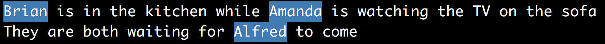
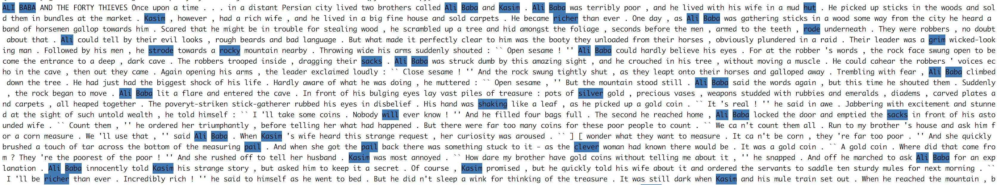

# First and Last Names Dataset

[](https://pepy.tech/project/names-dataset)
[](https://pepy.tech/project/names-dataset/month)

Attempt to make a good dataset with a high precision / recall.

- ~160k first names
- ~100k last names

## Installation
```
pip install names-dataset
```

## Usage
```python
from names_dataset import NameDataset
m = NameDataset()
m.search_first_name('Mikael')
m.search_last_name('Remy')
```

```
echo -e "$(python main.py 'Brian is in the kitchen while Amanda is watching the TV on the sofa.\nThey are both waiting for Alfred to come.')"
```



## How reliable is it?

Well, it depends if you are looking for a high recall or a high precision. For example, the word Rose can be either a name or a noun. If we include it in the list, then we increase the precision but we decrease the recall. And vice versa, if it's not in the list. The library checks that the word starts with a capital letter. In our case, we emphasize more on precision. So I would say the best use case here is to check whether it's a name or not based on a prior knowledge that the customer has submitted a name. If you are using this tool to look for name entities in the text, then be prepared to have a lot of false positives.

Here is an example on a (old) text: [ALI BABA AND THE FORTY THIEVES](http://textfiles.com/stories/ab40thv.txt).



A more reliable source would be to scrape this website: http://www.namepedia.org/. This database has probably been manually checked and contains more information such as gender and origin of the names.

## License

I don't own the data obviously. It's fetched from the websites listed in:

https://github.com/philipperemy/name-dataset/blob/master/generation/generate.sh

So I guess the most strict software license should apply here.

## Sources and References

Exhaustive list of all the possible websites. Not all are used since there is a lot of garbage in the lists.

- Generator: http://listofrandomnames.com/index.cfm?generated
- https://www.sajari.com/public-data: 5000 names (First Names CSV)
- http://www.20000-names.com/ names around the world
- https://catalogue.data.gov.bc.ca/dataset/most-popular-boys-names-for-the-past-100-years UK
- https://catalogue.data.gov.bc.ca/dataset/most-popular-girl-names-for-the-past-100-years UK
- https://www.nrscotland.gov.uk/statistics-and-data/statistics/statistics-by-theme/vital-events/names/babies-first-names/full-lists-of-babies-first-names-2010-to-2014 Scotland

- https://gender-api.com/en/pricing

- https://github.com/OpenGenderTracking/globalnamedata/tree/master/assets
- From https://bocoup.com/blog/global-name-data

- https://github.com/MatthiasWinkelmann/firstname-database

- http://www.namepedia.org/en/firstname/Nabil/

- https://datasets.imdbws.com/
- https://www.imdb.com/interfaces/

- https://opendata.stackexchange.com/questions/46/multinational-list-of-popular-first-names-and-surnames
- ftp://ftp.heise.de/pub/ct/listings/0717-182.zip

- https://data.world/howarder/gender-by-name

- https://statbel.fgov.be/en/open-data/first-names-total-population-municipality

- https://www.ons.gov.uk/peoplepopulationandcommunity/birthsdeathsandmarriages/livebirths/bulletins/babynamesenglandandwales/previousReleases

- http://www.cs.cmu.edu/afs/cs/project/ai-repository/ai/areas/nlp/corpora/names/

- https://www.ssa.gov/oact/babynames/limits.html

- https://www.ssa.gov/OACT/babynames/

- https://www.ssa.gov/cgi-bin/popularnames.cgi

- https://github.com/hadley/data-baby-names/blob/master/baby-names.csv

- http://www.quietaffiliate.com/free-first-name-and-last-name-databases-csv-and-sql/

- https://stackoverflow.com/questions/1452003/plain-computer-parseable-lists-of-common-first-names

- http://mbejda.github.io/

- https://www2.census.gov/topics/genealogy/1990surnames/dist.all.last

- https://opendata.stackexchange.com/questions/1108/database-of-names-of-japanese-and-non-japanese-people

- https://opendata.stackexchange.com/questions/12234/name-and-gender-dataset

- https://opendata.stackexchange.com/questions/7071/people-names-by-country

- http://www.randomnames.com/all-boys-names.asp

- https://en.wikipedia.org/wiki/List_of_most_popular_given_names#cite_note-ahram2004-2

- http://www.avss.ucsb.edu/NameFema.HTM

- http://www.oxfordreference.com/view/10.1093/acref/9780198610601.001.0001/acref-9780198610601?btog=chap&hide=true&page=248&pageSize=10&skipEditions=true&sort=titlesort&source=%2F10.1093%2Facref%2F9780198610601.001.0001%2Facref-9780198610601

- https://github.com/dominictarr/random-name/blob/master/first-names.txt

- https://github.com/smashew/NameDatabases/tree/master/NamesDatabases/first%20names

- https://www.behindthename.com/names

- https://incompetech.com/named/multi.pl
